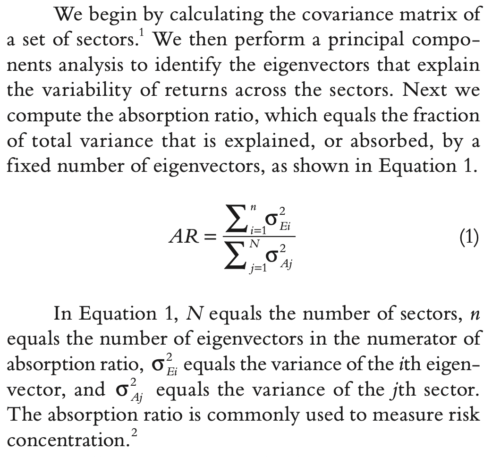
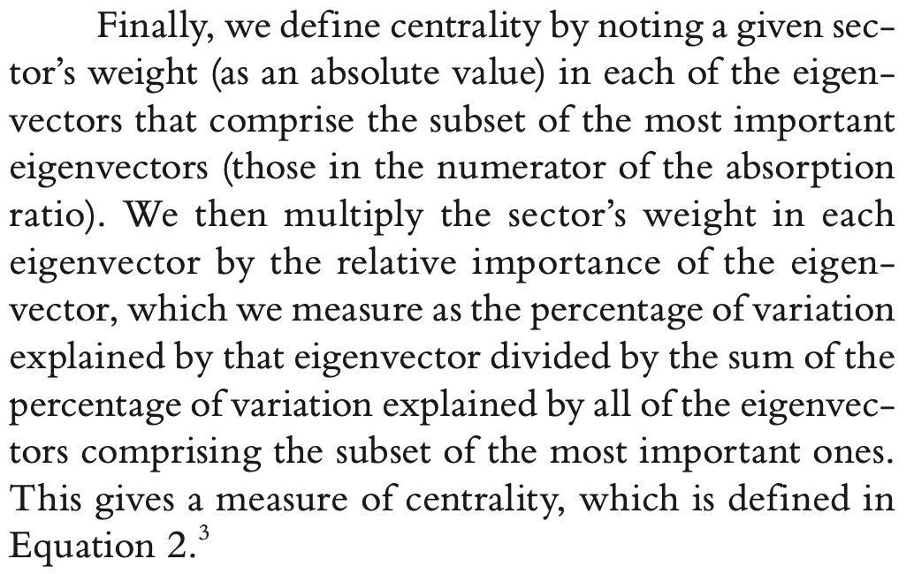
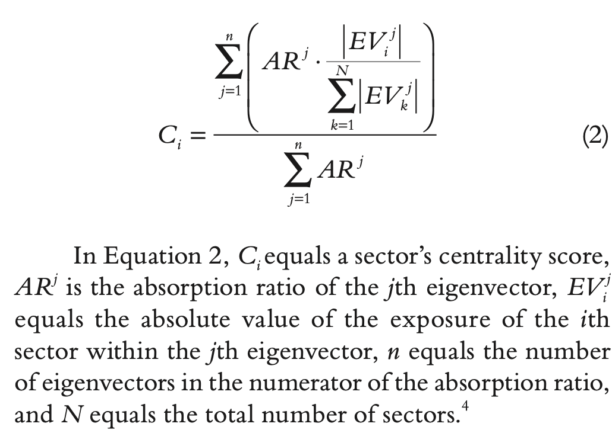
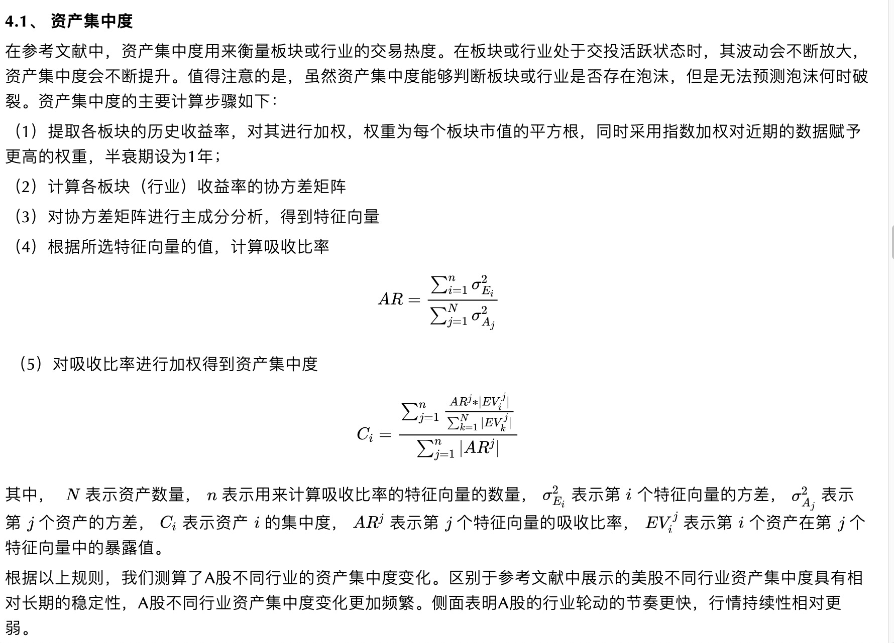
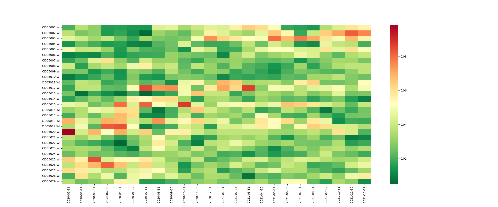
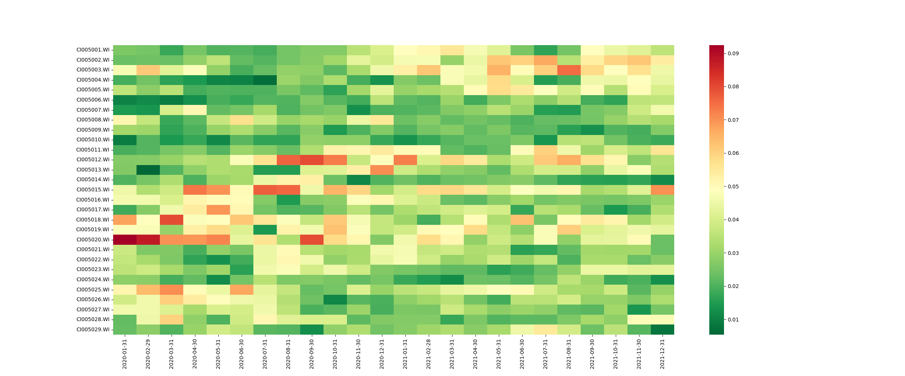

# 吸收比率、行业集中度和相对价值指标

基于“集中度”衡量的拥挤水平主要考虑两方面，分别是集中度和相对价值，集中度用来识别泡沫。通常认为，当一个行业集中度较高的时候，波动率会有所增加，资金大量涌入该行业同时也使该行业与其他行业的关联度有所提升，因此可以用集中度来衡量市场是否有拥挤现象，但是出现拥挤，或者说出现泡沫并不意味着泡沫会立马破裂，还需要根据相对价值指标来衡量泡沫是处于上升期还是破裂期。

## 集中度

集中度指标通过主成分分析法，计算每个行业对整体方差的贡献程度。某一资产的“集中度”越大，就代表该资产和其他资产关联度越高，并且自身波动率也更大。
行业i在某一时刻的“吸收比例”定义如下：

关于行业集中度的定义如下

具体处理方式如下

## 行业集中度的结果图

主成分个数为3，时间窗口60个交易日，采用指数加权平均收益率

主成分个数为5，时间窗口60个交易日，采用指数加权平均收益率

## 参考文献

[1]https://mp.weixin.qq.com/s/EO7uQic_wbH2WOI7x5R8aA
[2][Crowed Trades: Implications for Sector Rotation and Factor Timing](https://pan.baidu.com/s/1bnLqzavXsTU-qUyi5idl1A?pwd=c87f)
[3]https://mp.weixin.qq.com/s/YIGzAp6MlrVqIQ9VjpKvPw
[4]https://mp.weixin.qq.com/s/anXGG-KcBzCBcI3zRQH37Q